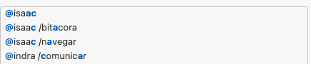
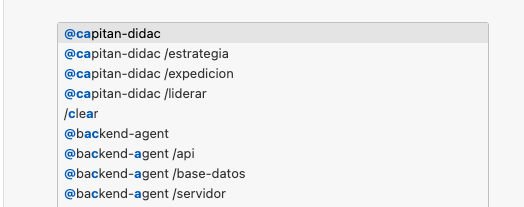

# 📜 ALEPH Scriptorium — Extensión VS Code

> **Framework de escritura asistida por IA para proyectos de largo aliento**

[](https://github.com/escrivivir-co/aleph-scriptorium)
[](../LICENSE.md)

## 🎯 Qué es

Esta extensión integra **ALEPH Scriptorium** con VS Code y GitHub Copilot Chat, proporcionando:

- **Vista de Agentes**: 20+ agentes organizados por capas (UI, Backend, Sistema, Plugins, Meta)
- **Vista de Plugins**: 8 plugins con sus recursos (agentes, prompts, instructions)
- **Vista de Backlogs**: Seguimiento visual de épicas, stories y tasks
- **ChatParticipants**: Invoca agentes directamente desde Copilot Chat (`@aleph`, `@ox`, `@blueflag`...)
- **Panel de Sprint**: Estado actual del sprint con métricas

## 📊 Sistema de Agentes

```
🐂 OX (Meta) ← Oráculo
│
├─── 🟢 UI (Producción): @aleph, @revisor, @periodico
├─── 🔵⚫🔴🟡🟠 Backend (Auditoría): 5 banderas
├─── ⚪ Sistema (Navegación): @vestibulo, @cartaspuerta
├─── ⚙️ Meta (Gestión): @pluginmanager, @ox
└─── 🔌 Plugins (Bridges): 8 plugin bridges
```


## Implemented (v.001)

- 
- 


# LEGACY


### 🎯 Core Philosophy

```
>>> SYSTEM INITIALIZED
>>> THEATER ENGINE: ONLINE
>>> AGENT MATRIX: READY
>>> NEURAL LINKS: ESTABLISHED
```

Arrakis Theater combines:
- **🎭 Theatrical Agent Orchestration**: Multi-agent performances in a digital stage
- **� Hacker Aesthetics**: Green-on-black terminals, matrix-style interfaces  
- **🤖 MCP Protocol Integration**: Advanced Model Context Protocol for agent communication
- **🧠 Neural Network Management**: Real-time agent spawning, configuration, and monitoring

## ⚡ Quick Start - Enter the Theater

### Prerequisites
- ✅ **VS Code 1.95.0 or higher**
- ✅ **Node.js 18+** for running managed theater processes
- ✅ **Socket.io server** for neural network monitoring

### 1. **Install the Theater Extension**

Search for "Arrakis Theater Chat Engine" in VS Code Extensions marketplace, or install directly:

```bash
>>> code --install-extension arrakis-theater.arrakis-theater-chat
```

### 2. **Activate Neural Links**

1. **Open GitHub Copilot Chat:**
   - Press `Ctrl+Alt+I` (Windows/Linux) or `Cmd+Alt+I` (Mac)
   - Or use Command Palette: `Ctrl+Shift+P` → "GitHub Copilot: Open Chat"

2. **Jack into Theater Network:**
   ```
   @arrakis initialize theater
   ```

### 3. **Theater Command Arsenal**

| Command | Description | Example |
|---------|-------------|---------|
| `@arrakis` | General theater assistance | `@arrakis How to configure MCP servers?` |
| `@arrakis /stage` | Stage configuration help | `@arrakis /stage Setup Socket.IO neural network` |
| `@arrakis /debug` | Theater troubleshooting | `@arrakis /debug Agent connection failed` |
| `@arrakis /spawn` | Agent creation examples | `@arrakis /spawn TypeScript MCP server` |
| `@arrakis /neural` | Neural network help | `@arrakis /neural Configure real-time rooms` |

### 4. **Theater Operations**

**🎭 Basic Stage Setup:**
```
@arrakis /stage How do I configure a basic MCP theater?
```

**🔧 Troubleshoot the Show:**
```
@arrakis /debug My MCP client can't connect to the server
```

**🤖 Spawn New Agents:**
```
@arrakis /spawn Show me a complete MCP server with Socket.IO
```

**🧠 Neural Network Management:**
```
@arrakis /neural How to handle automatic disconnections?
```

## 📚 Theater Documentation & Lore

### **Theater Archives:**

1. **📋 Stage Manual:** `THEATER_INSTALLATION_GUIDE.md`
   - Step-by-step theater setup
   - Neural network verification
   - Agent troubleshooting protocols

2. **⚡ Quick Hack Guide:** `README-DEV.md`
   - Development command arsenal
   - Hacker tips & tricks
   - Rapid debugging protocols

### **External Neural Networks:**

3. **🔗 AI Chat Tutorial:** [VS Code AI Chat Guide](https://code.visualstudio.com/api/extension-guides/ai/chat-tutorial)
   - Official chat participant protocols
   - Advanced agent orchestration concepts

4. **🛠️ VS Code Extension API:** [Extension API Docs](https://code.visualstudio.com/api)
   - Complete neural interface documentation

## 🧪 Theater Diagnostics

### **Neural Link Test:**```bash

# 1. Verificar extensión instalada

code --list-extensions | grep mcp

# 2. Abrir VS Code y probar

# Ctrl+Alt+I → @mcp hello

```

### **Debugging si no Funciona:**

1\. **Verificar GitHub Copilot:**

   - Extensions → buscar "GitHub Copilot" → debe estar activo

   - Command Palette → "GitHub Copilot: Sign In"

2\. **Verificar logs:**

   - `F12` → Console → buscar errores

   - View → Output → "AlephScript - All Logs"

3\. **Reinstalar si es necesario:**

   ```bash

   npm run uninstall:local

   npm run deploy:local

   ```

## 💡 Tips de Uso

- **💬 Conversaciones largas:** El chat mantiene contexto de la conversación

- **🎯 Comandos específicos:** Usa `/config`, `/troubleshoot`, etc. para respuestas especializadas

- **🔄 Historial:** Puedes hacer follow-up questions en la misma conversación

- **📝 Markdown:** Las respuestas incluyen formato, código y ejemplos

## 🆘 Soporte Rápido

Si tienes problemas:

1\. **Revisar prerequisitos** (Copilot activo)

2\. **Verificar logs** (F12 → Console)

3\. **Reinstalar extensión** (`npm run deploy:local`)

4\. **Consultar manual** (MANUAL_INSTALACION_LOCAL.md)

¿Te gustaría que probemos el chat participant ahora mismo o necesitas ayuda con algún paso específico? 🚀


# LEGACY------------------

MCP Socket.io Gamification Manager

A comprehensive VS Code extension for managing MCP (Model Context Protocol) Socket.io gamification ecosystems. This extension provides a centralized interface for configuration management, process control, UI orchestration, and real-time message monitoring.

## Features

### 🔧 Visual Configuration Editor
- **Interactive Config Management**: Edit complex JSON configurations through intuitive web-based forms
- **Multi-section Support**: Separate editors for App settings, Game configuration, Agent definitions, UI instances, and MCP servers
- **Real-time Validation**: Immediate feedback and error checking while editing
- **Auto-save Functionality**: Changes are automatically saved to your configuration file

### ⚡ Process Management
- **Launcher Control**: Start and stop your X+1 application launcher with any configuration file
- **MCP Server Management**: Individual control over multiple MCP server instances
- **Health Monitoring**: Built-in connection testing and status monitoring
- **Centralized Logging**: Unified log viewer for all managed processes

### 🎮 UI Management System
- **Multi-UI Support**: Manage various gamification interface types:
  - Custom console interfaces
  - HTML5 web applications
  - ThreeJS 3D experiences
  - Unity WebGL builds
  - WebRTC communication hubs
  - Node-RED visual flows
  - Blockly visual programming
- **Port Management**: Automatic port assignment and conflict resolution
- **Quick Launch**: One-click start/stop and browser opening for web-based UIs

### 📡 Socket.io Bus Monitor
- **Real-time Message Monitoring**: Live view of all socket.io communications
- **Three-Channel Architecture**: 
  - **Application Channel**: Game logic and agent interactions
  - **System Channel**: Infrastructure and health monitoring
  - **UserInterface Channel**: UI updates and user interactions
- **Room-based Communication**: Join and monitor specific communication rooms
- **Message Filtering**: Filter messages by channel type, room, or custom criteria
- **Interactive Testing**: Send custom messages to test your system

### 🔌 MCP Server Integration
- **Multi-server Support**: Built-in support for common MCP servers:
  - State Machine Server (game state management)
  - Wiki MCP Browser (knowledge access and web browsing)
  - DevOps MCP Server (system operations)
- **Health Checks**: Automatic connection testing and status reporting
- **Port Configuration**: Flexible port assignment with defaults for common servers

## Installation

### Development Installation
1. Clone this repository
2. Open the folder in VS Code
3. Run `npm install` to install dependencies
4. Press `F5` to launch the Extension Development Host
5. In the new VS Code window, the extension will be active

### Package Installation
1. Run `npm run compile` to build the extension
2. Run `vsce package` to create a `.vsix` file
3. Install the `.vsix` file in VS Code via Extensions > Install from VSIX

## Usage

### Getting Started
1. Open the Command Palette (`Ctrl+Shift+P` / `Cmd+Shift+P`)
2. Type "MCP Manager" to see available commands
3. Start with "Open Config Editor" to set up your configuration file

### Available Commands
- **Open Config Editor**: Launch the visual configuration editor
- **Start Launcher**: Start the X+1 application launcher
- **Stop Launcher**: Stop the launcher process
- **Open Socket Monitor**: Monitor real-time socket.io communications
- **Manage UIs**: Control all gamification user interfaces
- **Manage MCP Servers**: Control MCP server instances

### Configuration Structure
The extension works with JSON configuration files that define:
- Application type and launcher settings
- Game definitions with agent configurations
- MCP server bindings and health settings
- UI instance definitions with ports and types
- Orchestration settings for message routing

See `sample-config.json` for a complete example configuration.

## 🏗️ Architecture & Theater Ecosystem

### 1. **ESCENARIO System** - The Development Stage
This extension transforms VS Code into a **theatrical stage** where developers perform live-coding sessions. The interface provides:
- **>>> Agent Command Interface**: Hacker-style terminals for agent communication
- **🎭 Theater Views**: Specialized panels for different performance modes  
- **⚡ Real-time Orchestration**: WebSocket connections for live collaboration
- **🔧 DevOps Integration**: Direct connection to MCP servers and AI services

### 2. **Multi-Theater Orchestration Architecture**
The **Teatro Arrakis** is a flexible performance system capable of staging **multiple types of productions**:

- **🌐 Indra Agent**: Master orchestrator for cross-ecosystem communication and integration workflows
- **🏛️ Zeus-Architect**: Principal designer for DevOps expeditions and infrastructure narratives
- **🎭 Dynamic Agent Spawning**: Context-driven creation of specialized agents based on the current theatrical production
- **📚 Multiple Repertoires**: Support for various "obras" (works) - from DevOps expeditions to creative coding performances

**Framework Retro** provides the navigation system for different expeditions, while **Hacklabs** serve as scheduled theatrical sessions where different stories unfold depending on the chosen narrative and audience.

### 3. **Communication Patterns**
The theater supports a **three-channel neural network** for agent coordination:
- **🎯 Performance Channel**: Live-coding actions, agent collaborations, and theatrical execution
- **🔧 Infrastructure Channel**: System monitoring, health checks, and backstage operations  
- **🎭 Audience Channel**: UI updates, chat interactions, and real-time audience participation

## 🔧 Theater Requirements

- **VS Code 1.95.0+** - Core theater platform
- **Node.js 18+** - Neural network runtime  
- **Socket.io server** - Real-time communication matrix
- **MCP-compatible servers** - Agent orchestration protocols

## ⚙️ Theater Configuration

- `arrakisTheater.configPath`: Path to theater configuration file
- `arrakisTheater.autoStart`: Auto-launch theater services on workspace activation
- `arrakisTheater.hackerMode`: Enable matrix-style aesthetics and green terminal themes

## 🛠️ Hacker Development

### Theater Architecture
```
arrakis-theater-chat/
├── src/
│   ├── extension.ts          # Main theater controller
│   ├── configEditor.ts       # Stage configuration matrix
│   ├── processManager.ts     # Agent lifecycle orchestration  
│   ├── socketMonitor.ts      # Neural network monitoring
│   ├── uiManager.ts          # Theater UI management
│   └── mcpServerManager.ts   # MCP agent control
├── out/                      # Compiled theater bytecode
├── package.json              # Theater manifest
├── tsconfig.json             # TypeScript neural config
└── sample-config.json        # Example theater setup
```

### Compilation Protocols
```bash
>>> npm run compile      # Compile theater systems
>>> npm run watch        # Real-time development mode
>>> npm run package      # Create theater deployment package
```

### Neural Link Testing
```bash
>>> node test-extension.js   # Verify theater compilation and configuration
```

## 🤝 Join the Theater Collective

1. Fork the theater repository
2. Create an agent feature branch
3. Implement your theatrical enhancements
4. Run diagnostics and ensure neural links are stable
5. Submit a pull request to the main theater

## 🚨 Theater Diagnostics & Debugging

### Common Stage Issues
- **Theater not initializing**: Ensure VS Code version is 1.95.0+ 
- **Agent spawn failures**: Check that required neural ports are available
- **Socket.io disconnects**: Verify your neural network server is operational
- **MCP protocol errors**: Ensure MCP agents are installed and accessible
- **Hacker mode glitches**: Reset terminal aesthetics via `arrakisTheater.hackerMode` setting

### Debugging
- Use the Extension Development Host for testing
- Check the "MCP Socket Manager" output channel for logs
- Use the Socket.io Monitor to debug communication issues

## License

---

## 🎭 Welcome to the Theater

**Arrakis Theater Chat Engine** is your gateway to the **Teatro de Realidad Aumentada** - a living ecosystem where developers become performers, code becomes art, and AI agents collaborate in real-time theatrical productions.

### 🌟 The Theater Ecosystem

This extension is the **central STAGE** in a larger universe:

- **🎪 Escenario**: This VS Code extension where live-coding happens
- **🎬 Director**: `mcp-state-machine-driver` orchestrates the show
- **🎭 Performers**: Developers using Framework Retro for epic expeditions  
- **🤖 Supporting Cast**: Indra & Zeus-Architect agents + specialized crews
- **👥 Audience**: Real-time viewers via Twitch/chat integration
- **📚 Repertoire**: Multiple "obras" from DevOps expeditions to creative coding

### ⚡ Next Steps

1. **Install** the Arrakis Theater extension
2. **Connect** to the neural network via `@arrakis`
3. **Join** scheduled Hacklabs theatrical sessions
4. **Create** your own theatrical programming performances

```
>>> THE STAGE AWAITS, HACKER
>>> NEURAL LINKS ESTABLISHED
>>> BEGIN YOUR THEATRICAL CODING JOURNEY
```

---

**🎯 Repository**: [Arrakis Theater Chat Engine](https://github.com/escrivivir-co/arrakis-theater-chat)  
**📜 License**: ISC - See package.json for details  
**🎪 Support**: Use the repository's issue tracker for theater technical support

*"Where code meets theater, where AI meets human creativity, where hacker aesthetics meet artistic expression."*